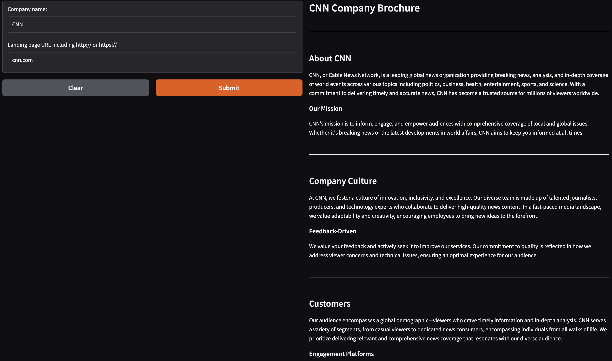

# 📄 BrochureGen

BrochureGen is an AI-powered tool that analyzes company websites and generates a short brochure in markdown format. It extracts relevant information such as company culture, careers, and customer details, making it useful for prospective customers, investors, and recruits.

## 🚀 Features
- **Website Scraping:** Extracts website content, including title, text, and links.
- **AI-Powered Analysis:** Uses OpenAI's API to generate a structured brochure.
- **Smart Link Filtering:** Identifies and selects relevant links (e.g., About, Careers pages).
- **Streaming Output:** Displays AI-generated content dynamically in the terminal.

## 🛠️ Installation

### 1️⃣ Clone the Repository
```bash
git clone https://github.com/AmirGadami/BrochureGen.git
cd BrochureGen
```

### 2️⃣ Install Dependencies
```bash
conda env create -f environment.yml
conda activate llms
```

## 🔧 Configuration
1. **Set up OpenAI API access:**
   - Add your OpenAI API key to a `.env` or `config.py` file.
   - Ensure the `MODEL` variable is correctly set.

2. **Modify `config.py` (if applicable)**
```python
MODEL = "gpt-4o-mini"  # Adjust the model as needed
```

## 🏃 Usage

Run the script and follow the prompts:
```bash
python main.py
```

### Example Input
```
Enter the company Name: CNN
Enter the company Website: cnn.com
```

### Example Output (Markdown Brochure)
```markdown
## About Us
CNN (Cable News Network) is a leading global news organization, delivering breaking news and in-depth analysis across a multitude of topics including politics, business, health, entertainment, science, and climate. Established with a commitment to journalistic integrity, CNN continues to be at the forefront of the news landscape, providing accurate and timely updates worldwide.

## Our Mission
At CNN, our mission is to inform, engage, and empower our audience by presenting the news that matters. We aim to drive conversations and foster understanding of critical issues impacting communities globally.

## Company Culture
CNN embraces a culture of innovation, collaboration, and respect. We are passionate about our work and believe in the importance of a diverse and inclusive workplace. Our team thrives in an environment where ideas are shared freely, where feedback is encouraged, and where every member's contribution is valued.

## Our Customers
CNN serves a broad audience across various demographics, delivering news and information tailored to the interests of viewers and readers. Our offerings include live television broadcasts, multimedia content, newsletters, and interactive platforms, ensuring that our audience is well-informed on local, national, and international news.

## Careers at CNN
Join us in our mission to inform the world! CNN offers a variety of career opportunities across different fields such as journalism, broadcasting, digital media, technology, and marketing. Whether you are an experienced professional or a passionate newcomer, CNN provides a supportive environment for growth and development. Explore job openings and be part of a company that stands for excellence in news reporting.

## Stay Connected
Follow CNN on social media or visit our website for the latest updates, subscribe to our newsletters, and engage with our diverse range of content. Your feedback is important to us, and we encourage you to connect with us to help improve your experience.

---
### Sample Web UI Screenshot
Here’s how the web interface looks:



---

### Contact Us
For inquiries, feedback, or career opportunities, please visit [CNN Careers](https://jobs.cnn.com).
```

## 🛠️ Project Structure
```
📂 BrochureGen
├── 📜 main.py          # Main script to generate the brochure
├── 📜 llm.py           # AI processing and streaming logic
├── 📜 scraper.py       # Website scraping logic
├── 📜 config.py        # Configuration settings (e.g., API keys, model selection)
├── 📜 environment.yml  # Dependencies
├── 📜 README.md        # Project documentation
```

## 📝 TODO / Future Enhancements
- ✅ Improve link selection logic for better relevance.
- ✅ Implement multi-page scraping for more detailed brochures.
- 🚀 Add support for saving brochures as PDF or HTML.
- 🚀 Develop a web-based UI for user interaction.

## 📜 License
This project is open-source and available under the [MIT License](LICENSE).

## 🤝 Contributing
Contributions are welcome! Feel free to open an issue or submit a pull request.

## 📞 Contact
For questions or suggestions, reach out via [ah.ghadami75@gmail.com](mailto:your-email@example.com).

